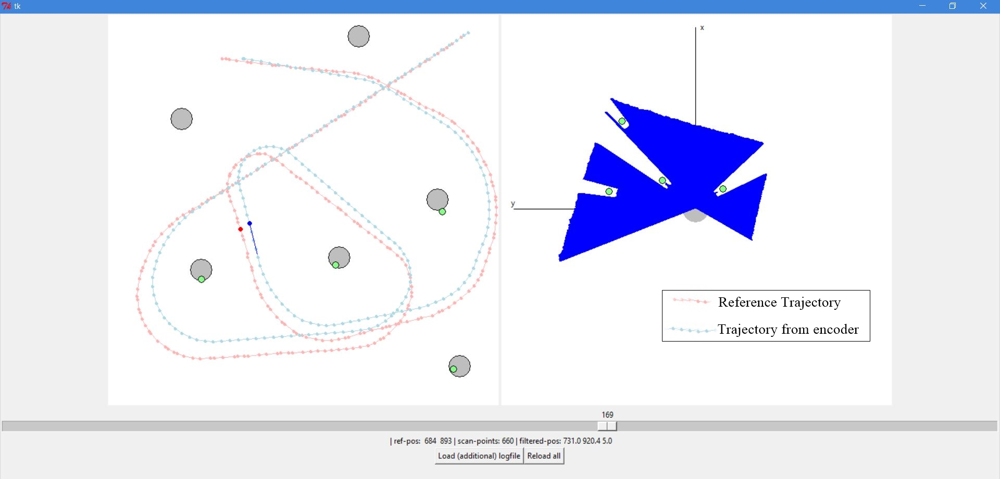

# Autonomous-Driving - SLAM

  This project is a part of **SLAM** and **Path Planning** course given by the professor *Claus Brenner* from the *University of Leibniz*. The course is based on the data (LiDAR and Encoder) collected from a lego based robot with caterpillar tracks navigated through a controlled environment. 
  
## Overview

### Projects
<table style="width:75%">
  <tr>
    <th>
      

           
            <a href="https://github.com/KarthickPN/Autonomous-Driving---SLAM/tree/master/Unit_A" name="p1_code">Unit_A: Motor and Motion Model </a>
        

    </th>
    <th>
      

           
            <a href="https://github.com/KarthickPN/Autonomous-Driving---SLAM/tree/master/Unit_B" name="p1_code">Unit_B: Feature based and Featureless localization </a>
        

    </th>
  </tr>
</table>
--- 

## Table of Contents

#### [Motion Model]
 - **Summary:** Developed a motion model, found the trajectory from the encoder data and identified landmarks from LiDAR data.
 - **Keywords:** Motion model, motor model, LiDAR data.       
