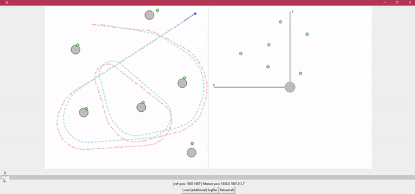
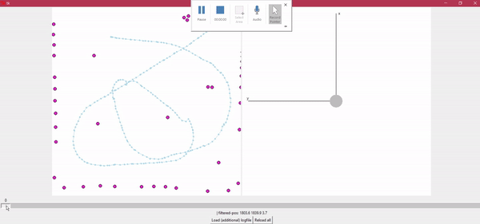
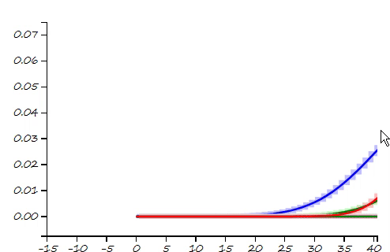

# Autonomous-Driving - SLAM

  This project is a part of **SLAM** and **Path Planning** course given by the professor *Claus Brenner* from the *University of Leibniz*. The course is based on the data (LiDAR and Encoder) collected from a lego based robot with caterpillar tracks navigated through a controlled environment. 
  
## Overview

### Projects
<table style="width:100%">
  <tr>
    <th>
      

           
            <a href="https://github.com/KarthickPN/Autonomous-Driving---SLAM/tree/master/Unit_A" name="p1_code">Unit_A: Motor and Motion Model </a>
        

    </th>
    <th>
      

           
            <a href="https://github.com/KarthickPN/Autonomous-Driving---SLAM/tree/master/Unit_B" name="p1_code">Unit_B: Feature based and Featureless localization </a>
        

    </th>
    <th>
      

           
            <a href="https://github.com/KarthickPN/Autonomous-Driving---SLAM/tree/master/Unit_C" name="p1_code">Unit_C: Bayes Filter </a>
        

    </th>
  </tr>
  <tr>
    <th>
      

           
            <a href="https://github.com/KarthickPN/Autonomous-Driving---SLAM/tree/master/Unit_D" name="p1_code">Unit_D: Extended Kalman Filter </a>
        

    </th>
  </tr>
</table>
--- 

## Table of Contents

#### [1. Motion model](Unit_A)
 - **Summary:** Developed a motion model, transformed the motor ticks of the robot into a real world trajectory and corrected the calibration error by using the LiDAR data to detect the location of the landmarks in scanner's coordinate system.
 - **Keywords:** Motion model, motor control, LiDAR and encoder data.

#### [2. Localization](Unit_B)
 - **Summary** _Feature Based Localization:_ Assigned the detected landmarks to the respective landmarks in the map, developed the mathematics for similar
